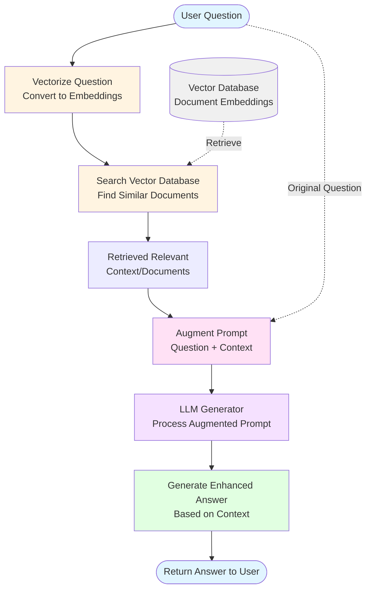

# RAG (Retrieval-Augmented Generation)

## Architecture Diagram

## How RAG Works

RAG (Retrieval-Augmented Generation) enhances LLM responses by retrieving relevant information from a knowledge base before generating answers.

**Pipeline Steps:**
1. **User Question** - The user submits a query
2. **Vectorization** - Question is converted to embeddings
3. **Retrieval** - System searches vector database for similar documents
4. **Augmentation** - Retrieved context is combined with the original question
5. **Generation** - LLM generates answer using both question and context
6. **Output** - Enhanced answer is returned to user
